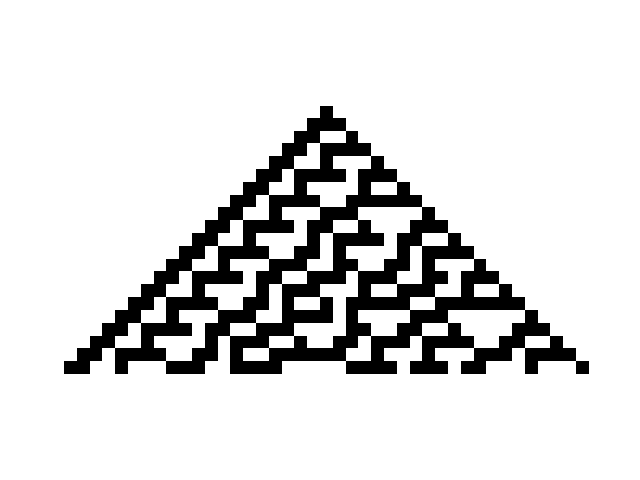
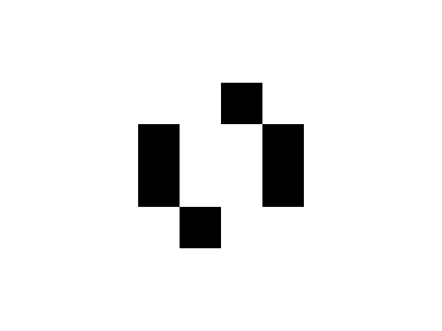

# cavl

`cavl` is a simple library for simulating and visualizing various cellular automata.

## Installation

Install using `pip`:

```
pip install cavl
```

## Usage

`cavl` provides two main classes for creating and simulating cellular automata: `CellularAutomaton1D` and `CellularAutomaton2D`, for 1D and 2D cellular automata respectively.

Both classes take the same number and type of parameters for initialization:

- `init`: the starting grid for the cellular automata
- `neighbors`: list of coordinates to represent the neighborhood of a cell
- `apply`: function to apply a given rule to a single cell (signature depends on whether working with 1D or 2D cellular automata)
  - **1D**: takes dictionary with keys as relative coordinates of a neighbor and values representing the current state number of that neighbor (`dict[tuple[int, int], float]`)
  - **2D**: takes same dictionary as with **1D** `apply` function, as well as the state number of the current cell being worked on
  - The given `apply` function should return the state number that the current cell should be in the next generation.

### Neighborhoods

`cavl` provides built-in helper functions for retrieving lists of tuple coordinates representing common neighborhoods.

- `moore(radius: int)`: returns list of `tuple[int, int]` representing a Moore neighborhood with given `radius` (default of 1)
  - i.e. `moore()` returns `[(-1, -1), (0, -1), (1, -1), (-1, 0), (1, 0), (-1, 1), (0, 1), (1, 1)]`
- `von_neumann(radius: int)`: returns list of `tuple[int, int]` representing a von Neumann neighborhood with given `radius` (default of 1)
  - i.e. `von_neumann()` returns `[(0, -1), (-1, 0), (1, 0), (0, 1)]`

### Visualization

`cavl` provides several built-in functions for visualizing your cellular automata:

- `plot`: used to visualize the generations of a 1D cellular automaton
- `animate`: used to animate the progression of the generations of a 1D cellular automaton
- `plot2d`: used to visualize the most recent generation of a 2D cellular automaton
- `animate2d`: used to animate the progression of the generations of a 2D cellular automaton

### 1D Cellular Automata

#### Rules

`cavl` also provides some built-in classes for common cellular automata rules. Currently, there are only two built-in 1D cellular automata rules: 
- `General1DRule`: takes a rule using the [Wolfram code](https://en.wikipedia.org/wiki/Wolfram_code) naming system
- `Totalistic1DRule`: rule that looks at the **total** of the values of the cells in a neighborhood; more information [here](https://mathworld.wolfram.com/TotalisticCellularAutomaton.html)

#### Example

```python
import cavl

start = cavl.init(50)  # returns 1D array with width of 50

rule = cavl.General1DRule(30)

automaton = cavl.CellularAutomaton1D(init=start, neighbors=rule.neighbors, apply=rule.apply)
automaton.evolve(20)

cavl.plot(automaton, save=True, filename='1D_automaton')
```



### 2D Cellular Automata

#### Rules

Currently, there are no built-in rule classes that work with 2D cellular automata; some will be added later on.

#### Example

```python
import cavl

# simple period 2 oscillator
start = [[0, 0, 0, 0, 0, 0, 0, 0],
         [0, 0, 0, 0, 0, 0, 0, 0],
         [0, 0, 0, 0, 0, 0, 0, 0],
         [0, 0, 0, 1, 1, 1, 0, 0],
         [0, 0, 1, 1, 1, 0, 0, 0],
         [0, 0, 0, 0, 0, 0, 0, 0],
         [0, 0, 0, 0, 0, 0, 0, 0],
         [0, 0, 0, 0, 0, 0, 0, 0]]

neighbors = cavl.moore()

# Conway's Game of Life rules
def apply(neighbors, current) -> int:
    alive = sum(neighbors.values())
    if current == 1 and (alive == 2 or alive == 3):
        return 1
    elif current == 0 and alive == 3:
        return 1
    else:
        return 0


automaton = cavl.CellularAutomaton2D(init=start, neighbors=neighbors, apply=apply)
automaton.evolve(21)

cavl.plot2d(automaton, save=True, filename='2D_automaton')
```



## TODO

- [ ] More built-in rules
  - [ ] Cyclic
  - [ ] Life-like
- [ ] Additional grid layouts
  - [ ] Hexagonal
  - [ ] Triangular
- [ ] ...and more